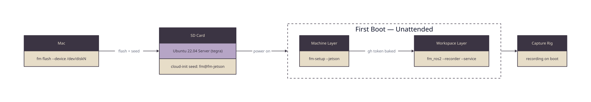

# fm-setup

Machine provisioning for First Motive. One repo defines what a First Motive host
is, so any machine can be rebuilt from a clean install without anyone
remembering what was done to the last one.

Three roles:

```
workstation   Ubuntu 26.04, RTX GPU   training, annotation, sim
jetson        Ubuntu 22.04, Orin Nano capture rig
trainer       Ubuntu 26.04, cloud GPU training only
```

`trainer` is the one role hardware detection cannot find — a cloud GPU instance
looks exactly like a tower — so it is named once with `--trainer` and recorded
on the machine's card, which every converge afterwards reads.

fm-setup owns the **machine** layer — drivers, container runtime, ROS 2, users,
kernel tuning. [`fm_ros2`](https://github.com/first-motive/fm-ros2) owns the
workspace layer on top of it.

## Quick Start

On a machine that already has the repo:

```bash
./install.sh --workstation      # provision
./install.sh --check            # report state, change nothing
./install.sh --list             # show the role's steps
```

On a fresh machine, pin the URL to a release tag:

```bash
curl -fsSL https://raw.githubusercontent.com/first-motive/fm-setup/v0.1.22/install.sh | bash -s -- --workstation
```

To read it first:

```bash
curl -fsSL https://raw.githubusercontent.com/first-motive/fm-setup/v0.1.22/install.sh -o install.sh
less install.sh && bash install.sh --workstation
```

The curl path clones this repo into the machine's workspace — `/opt/fm/fm-setup`
unless the machine's identity card says otherwise — and hands over to the
checkout, because the manifest and the steps live in the repo, and a provisioned
machine needs them on disk to re-check itself later.

Every package a step installs is recorded against that step, in a ledger under
`/var/lib/fm-setup/pkgs`. That is what lets one step be uninstalled without
taking another's dependencies with it: a removal that would reach outside the
step's own ledger aborts and names what it would have taken. `--check` ends by
reporting drift — packages, units enabled since the machine was provisioned, and
`/etc` changes that no step accounts for — and `fm pkg add <name>` records a one-off so it is accounted for
from the moment it lands.

The workspace is not an arbitrary choice of directory. It is the card's
`workspace` field, the one visible parent every First Motive checkout shares,
and it is where the `fm` CLI looks: a copy of this repo kept anywhere else is one
`fm doctor` reports as *not cloned* on the machine that is running it. A checkout
left at the old `~/.first-motive/fm-setup` is moved into the workspace on the
next provisioning run, with a symlink left behind so existing paths still work.

There are two workspaces on a shared machine, and the difference matters:

| whose | where | named by |
| --- | --- | --- |
| the machine's | `/opt/fm`, group `fm`, mode 3775 | the card |
| a person's | `~/fm` | their own `FM_HOME` |

The machine's is what the card names and what services read, so it lives outside
every home directory — a home is mode 700 on Ubuntu, and a workspace inside one
is readable by exactly one account. A person's own outranks the card, which is
why `fm setup-onboard` writes `FM_HOME` and nothing else has to. A machine
provisioned before this split keeps `/home/fm/fm` until `fm machine init` moves
its card; `machine doctor` says so in the meantime, and `/home/fm/fm` stays
reachable afterwards through a symlink.

### What The Curl Path Trusts

Piping a script into a shell means the script decides what to verify, so it can
never meaningfully verify itself. Being precise about that matters more than a
command that looks secure:

| fetched | verified by |
| --- | --- |
| `install.sh` | nothing — it is already running by the time anything could check it |
| `lib.sh` | `FM_LIB_SHA256`, before it is sourced |
| the checkout (every step script) | `FM_SETUP_SHA`, after the clone |

Both gates are off unless you set them. For a machine you are sitting at, TLS
and this repo are the trust anchor and that is usually enough. For one that
provisions unattended, pin all three by fetching from a commit rather than a
tag — a tag is a name and can be moved by anyone who can push; a commit sha is
the content and cannot:

```bash
TAG=v0.1.22
SHA=<commit sha for that tag>
LIB=<lib.sh sha256 for that tag>

curl -fsSL "https://raw.githubusercontent.com/first-motive/fm-setup/$SHA/install.sh" \
  | env FM_TAG="$TAG" FM_SETUP_SHA="$SHA" FM_LIB_SHA256="$LIB" \
        bash -s -- --workstation
```

Fetching `install.sh` by sha makes the first file immutable too, which is the
part no checksum inside the script can cover. A mismatch on either gate aborts
before the machine is touched.

Every release publishes both values on its
[releases page](https://github.com/first-motive/fm-setup/releases). Derive them
from a clone instead if you would rather not trust a web page:

```bash
git rev-parse "$TAG^{commit}"
git show "$TAG:lib.sh" | shasum -a 256
```

### Cutting A Release

The front door is `fm release`, not a script in this repo. It checks that CI is
green on the commit a tag would land on before anything is tagged, and only then
delegates to `scripts/dev/cut-release.sh` here:

```bash
fm release --repo fm-setup                    # is the next tag safe to cut?
fm release --repo fm-setup --cut -- --apply   # gate, then cut and push the tag
```

Calling the script directly skips that gate, which is why a hook blocks it and
points back at the verb. What the verb delegates to:

```bash
scripts/dev/cut-release.sh              # print the plan, change nothing
scripts/dev/cut-release.sh --apply      # create and push the tag
scripts/dev/cut-release.sh --set vX.Y.Z # prepare the bump commit for a PR
```

The release is two halves. A tag a rig resolves at flash time is one; the
version written into the files a human pastes from is the other.

The tag appears in exactly one machine-readable place — `install.sh`'s `FM_TAG` —
because `install.sh` is the only file that ever arrives on its own, piped into a
shell with no checkout behind it to read a version from. `run.sh` and the flash
seed derive it from there at runtime; the curl one-liners in this file and in
`install.sh`'s header are text a human pastes, so they are generated from it
instead and CI fails a pull request where they disagree. `release-tag.sh` owns
that half, and `cut-release.sh` reads it rather than repeating it:

```bash
scripts/dev/release-tag.sh              # what is pinned now
scripts/dev/release-tag.sh --check      # what CI checks
scripts/dev/release-tag.sh --set vX.Y.Z # bump the pinned version, for a PR
```

### Converging An Appliance

A Jetson in the field is not a machine anyone re-provisions by hand. `fm_ros2`'s
`fm-update-<role>.timer` ticks every ~15 minutes on each rig, and fm-setup is
one of the checkouts it converges. The entry point it calls is this repo's:

```bash
scripts/update.sh          # converge this host's role, non-interactively
scripts/update.sh --check  # what a converge would find, change nothing
```

The role comes from the machine's identity card, so no caller has to know
whether a given rig is a jetson or a workstation. `fm update` uses the same
script after a clean pull.

What that grants is worth stating plainly, because a timer that runs code as
root on every rig unattended is a real risk surface:

- **It follows tags, never a branch.** The timer only ever checks out a newer
  `v*` release tag. A commit merged to `main` and left untagged moves no machine.
- **It refuses to force anything.** A checkout with tracked modifications is
  logged and skipped, never stashed or reset.
- **It runs while nothing is in flight.** A rig mid-take is left alone and
  retried on the next tick.
- **It widens nothing.** The fleet already holds the git credentials and the
  passwordless sudo this uses; no new secret, key, or inbound path is added.

The consequence is that whoever can push a `v*` tag here decides what runs as
root on every rig. That is why `.github/CODEOWNERS` names one reviewer, and why
the tag is cut deliberately rather than on merge.

## Flashing A Machine

Both roles start before the OS exists. The `flash` verb writes the role's pinned
image to removable media and puts a seed on it that answers every question the
first boot would otherwise ask, so neither machine needs a monitor, a keyboard,
or a wizard.

```bash
# The capture rig — an SD card for the Jetson.
fm flash --device /dev/disk4                    # or: ./run.sh flash --device …
fm flash --device /dev/disk4 --wifi "rig-lan:psk"

read -rs FM_GH_TOKEN && export FM_GH_TOKEN      # token, without leaking it
fm flash --device /dev/disk4
```

```bash
# The GPU workstation — a USB stick for Ubuntu Desktop.
read -rs FM_FLASH_PASSWORD_HASH && export FM_FLASH_PASSWORD_HASH
fm flash --role workstation --device /dev/disk4 --name fm-ws-01
```

The workstation's password is a console login, so the installer wants it already
hashed. Generate one with `mkpasswd --method=SHA-512 --rounds=4096`. It is the
one credential a workstation needs and a rig does not: the rig's account is
locked and reached by key alone, while somebody sits down in front of a
workstation.



The media boots as `fm@<name>` — SSH keys injected, password login locked — and
provisions itself: this repo's role, then fm_ros2's workspace layer (the
recorder service on a rig, the processor on a workstation). Those overlays are
private, so that second layer runs unattended only when `--gh-token` (a
read-only fine-grained PAT) was baked at flash time; without one, first boot
stops after the machine layer and leaves the remaining one-liner in
`~/NEXT-STEP.md` on the machine.

The two roles differ in one place a person can see. The Jetson image carries its
cloud-init seed inside its own root filesystem, so `flash` replaces it there and
the card boots straight through. An ISO's filesystem is read-only, so the
workstation's seed rides in a second FAT partition labelled `CIDATA` written
after the ISO — which the installer finds, but only once its boot menu has been
told to go ahead. That is one keypress on the machine, and the only part of a
workstation rebuild that is not unattended. Removing it means remastering the
ISO with an `autoinstall` kernel argument, which is
[issue #36](https://github.com/first-motive/fm-setup/issues/36).

Both layers are pinned to a release tag, resolved at flash time and baked into
the card: this repo's from its own `install.sh`, fm_ros2's from the newest `v*`
tag on its remote. A card therefore provisions the same way in a month as it
does today, whatever has merged since. `flash --dry-run` prints both refs, since
that claim is only worth anything if you can read which two it means.

| flag | effect |
| --- | --- |
| `--role` | `jetson` (default) or `workstation`; picks the image, the seed, and the install chain |
| `--device` | target disk, whole device; internal disks are refused |
| `--name`, `--user` | identity (defaults `fm-rec-01` / `fm-ws-01`, and `fm`); the name becomes the hostname, the mDNS name, and the ROS namespace |
| `--fleet`, `--transport`, `--workload` | the rest of the seeded identity card (defaults `prod`, `zenoh`, and the role's own workload) |
| `--ssh-key` | public key to authorize (default: every `~/.ssh/*.pub`) |
| `--password-hash` | console password, already hashed — workstation only, and required there |
| `--wifi ssid:psk` | join wifi on boot — jetson only; the workstation is a wired box |
| `--tailscale-authkey` | join the tailnet on first boot — use an ephemeral key |
| `--gh-token` | org access for the private overlays |
| `--no-provision` | identity only, no first-boot installs |
| `--dry-run` | print the plan, touch nothing |
| `-y`, `--yes` | skip the erase confirmation |

A name has to match its role: `fm-rec-01` is a jetson and `fm-ws-01` is a
workstation, and `flash` refuses the pair that disagrees rather than baking a
card whose topics land under the wrong namespace.

Prerequisites, jetson: the board's QSPI must carry NVIDIA's r36.x UEFI firmware
— any Orin that has booted JetPack 6 qualifies. On macOS the seed swap needs a
container runtime (OrbStack or Docker), because the image's rootfs is ext4.

Prerequisites, workstation: `sgdisk` on the machine doing the flashing, for the
seed partition — `brew install gptfdisk` on macOS, `apt install gdisk` on Ubuntu.
The workstation itself needs nothing beyond the stick: boot it, pick the stick
from the firmware's boot menu, and confirm the autoinstall when it asks. Then
leave it alone — the install, the reboot, and both provisioning layers run
without anyone there. Follow them the same way a rig is followed:

```bash
ssh fm@fm-ws-01.local tail -f /var/log/fm-first-boot.log
```

balenaCLI is used to write and validate the media when present; plain `dd`
otherwise.

Pass the two secrets through the environment — `FM_GH_TOKEN` and
`FM_TS_AUTHKEY` — rather than as flags. An argument is visible in the process
table to every user on the machine and is recorded in shell history; `read -rs`
into an exported variable is neither. The flags remain for a scripted caller
that already holds the secret safely.

Whichever way they arrive, both sit in plain text in the card's seed until first
boot consumes them: hand the card straight to the Jetson, and prefer ephemeral,
least-scope credentials.

A write that fails part-way is reported, and the card is read back and compared
to the image before the verb reports success — a reader that drops off the bus
mid-write otherwise leaves a valid partition table over a half-written
filesystem, which fails at boot, far from its cause.

## The Machine Identity Card

One file per machine says what that machine is. Everything host-shaped is
derived from it rather than typed a second time somewhere else.

```
/etc/fm/machine.json          Linux
~/.config/fm/machine.json     macOS
```

```json
{
  "schema_version": 1,
  "name": "fm-rec-01",
  "role": "jetson",
  "fleet": "prod",
  "transport": "zenoh",
  "workload": "recorder",
  "workspace": "/opt/fm"
}
```

```
name ──┬─→ hostname
       ├─→ mDNS + tailnet name
       └─→ ROS namespace   fm-rec-01 → fm_rec_01   (derived, never typed)

transport ─→ the middleware profile every process on the host sources
workload  ─→ the comms bridge profile      (optional — see below)
robot     ─→ which robot this machine is   (robot role only — see below)
workspace ─→ where every First Motive checkout lives
```

The name is shaped `fm-<abbrev>-<nn>`, so a second recorder is `fm-rec-02` and
two rigs can share a LAN. The singular `fm-jetson` this replaces could not
express that, and the collision showed up as topics that silently went nowhere.

```bash
fm machine init --name fm-rec-01   # write the card, align the hostname
fm machine show --json             # read it back, namespace included
fm machine doctor                  # check it against the schema and this host
fm machine reset                   # remove it
```

`init` is idempotent and repairs in place: fields you do not pass keep the value
already on the card, and the hostname is re-aligned to the name on every run.
`doctor` only reports — it never changes the machine, so it is safe on a host
nobody wants touched today.

`./run.sh flash` bakes the card into the cloud-init seed, so a rig boots already
knowing which recorder it is. Pass `--name` when flashing the second card of a
role.

`workload` is the one optional field. It answers what a machine *does*, which
`role` cannot: a recorder rig and a processor rig are both `jetson`, and that
gap is why `FM_BRIDGE_PROFILE` was the last per-host value anyone still typed
into an env file. It is optional because it is genuinely not universal — a
machine that runs no bridge needs no value, and requiring one would force a
meaningless answer onto it. Absent means this machine hosts no workload;
`--workload none` clears it when a machine is repurposed.

A Mac is `cockpit`. Under the zenoh transport its DDS graph is loopback-only, so
without a bridge its ROS tools see nothing the fleet publishes; the `cockpit`
profile is the mirror of a rig's — the fleet's published set in, teleop commands
out.

The GPU tower is `workstation`. It runs the sim and the dataset engine together,
so its bridge is the union of `robot` and `processor`; `processor` alone left it
holding a session and publishing no joint states (fm-comms#20).

```bash
fm machine init --name fm-rec-01 --workload recorder
fm machine init --workload cockpit           # a Mac: its own bridge
fm machine init --workload workstation       # the GPU tower: robot + processor
fm machine init --workload none              # repurposed; no bridge any more
```

`robot` is the second optional field, and the one a `robot` card must carry. A
robot arrives on its vendor's own OS and is adopted rather than flashed, so
fm-setup provisions nothing on it and the card is all the fleet knows about it.
The field names which robot it is, because `role` cannot: an Anvil workcell and
an Axol are both robots and share not one interface. fm-comms selects the anvil
bridge profile from it, and the robot agent selects its adapter from it.

```bash
fm machine init --name fm-rob-01 --role robot --robot anvil-openarm-v2 \
  --workload robot
fm machine init --name fm-rob-02 --role robot --robot axol
```

`fm device adopt` runs that command as one of its five steps, so the card is
written the same way whether a person types it or the adopt flow does.

A flashed card defaults to `recorder`, because a flashed card is a capture rig.
`machine init` has no default, because it also runs on machines with no bridge
at all.

The contract lives in `templates/machine/machine.schema.json`, which is the file
to read when a consumer in another repo needs to know what it may rely on. A
reader that finds a `schema_version` it does not know must refuse the card
rather than guess at it.

The writer is tested, because four other repos read what it produces and none
of them run this repo's CI:

```bash
./scripts/dev/test-machine.sh    # 57 cases, temp file, no root
```

A machine without a card is not broken. A laptop running the desktop app in
client mode has no workspace and needs no card; only a host that provisions,
records, or serves does.

## The Rule

No system-level change outside a step in this repo.

If a machine needs a package, a sysctl, a udev rule, or a user, it goes in a
step and gets committed. The consequence is that the scripts are the
documentation: a prose description of a machine drifts, a script that provisions
it cannot. This applies to people and to AI agents equally. The managed
`CLAUDE.md` holds the full rule, and personal onboarding prints `~/AGENTS.md`
at SSH login as its first-read router.

## Layout

```
install.sh              provisioning front door — role dispatch, flag parsing
run.sh                  verb front door — dispatch to scripts/run/
lib.sh                  shared functions, sourced never executed
fm.json                 verbs mounted onto the fm CLI

scripts/
├─ manifest.sh          step registries + package arrays — data, no logic
├─ steps/               one file per provisioning step, runnable standalone
├─ run/                 person-typed verbs, each declared in fm.json
├─ internal/            called by another script, never typed
└─ dev/                 developer tooling — not part of provisioning

docs/diagrams/          d2 sources + rendered svg sidecars
templates/              files a step deploys onto the machine
└─ machine/             the identity card's schema — the cross-repo contract
```

Roles share `scripts/steps/` rather than owning a directory each, so a step more
than one role needs is written once and listed in each registry.

## Steps

A step is a small script with three modes and no other surface:

| mode | contract |
| --- | --- |
| `check` | report state, change nothing, always exit 0 |
| `install` | make it so, idempotently — a re-run converges |
| `uninstall` | reverse what install did, where reversible |

```bash
bash scripts/steps/00-system-update.sh check      # a step runs standalone
```

Each step sources `lib.sh` and `scripts/manifest.sh`, defines `do_check`,
`do_install`, and `do_uninstall`, then ends with `fm_dispatch "$@"`.

Adding one is two edits: write `scripts/steps/<NN>-<name>.sh`, then register it
in the role's array in `scripts/manifest.sh` as `id|file|default`.

## People

The repo holds no roster. The account that provisions a machine is its
administrator and the only one with sudo; everyone else is added afterwards into
the shared `fm` group, with no ability to change the host. Who is on a machine
is answered by two live things — the tailnet ACL and the `fm` group — and by
nothing in this repo, because a name in a committed file is stale the day
someone joins or leaves.

Onboarding one person has three owners, in this order:

```
tailnet ACL   →   administrator        →   the person
maps them         ./run.sh add-user        fm setup-onboard
to a unix         account, fm group,       tools, workspace, sign-in
account           /data, no sudo
```

### 1. The ACL Maps A Person To An Account

Tailscale SSH decides who may log in as whom, and it needs to be told that
`matt@ubundi.co.za` is the unix account `matt`. Without a rule naming the
account, a new passwordless user cannot log in at all — the account exists and
nothing can reach it. One `accept` rule per person:

```jsonc
{
  "action": "accept",
  "src":    ["matt@ubundi.co.za"],
  "dst":    ["tag:ssh-server"],
  "users":  ["matt"]
}
```

`tag:ssh-server` is the tag the machines carry — confirm a host's own with
`tailscale status --json | jq .Self.Tags` before writing a rule against it.

The administrator's own account is reachable under `"action": "check"` instead,
which re-authenticates before each session. Everything about who may log in
lives here; this repo holds none of it.

### 2. The Administrator Creates The Account

```bash
./run.sh add-user matt        # account + fm group + /data access, no sudo
sudo deluser --remove-home matt
```

New accounts have no password and log in over Tailscale SSH. The machine's
`CLAUDE.md` reaches them through `/etc/skel`.

`bash scripts/steps/70-users.sh check` warns when a workstation's `fm` group
holds nobody but the administrator. A rebuild takes every account with it, so
that warning is the only thing on a freshly reinstalled machine that says the
team is gone.

### 3. The Person Onboards Themselves

Everything after the account belongs to the person whose account it is — the
tools land in their home, and the credentials are theirs to type.

```bash
fm setup-onboard
```

One command, and no checkout of your own. The `fm` CLI is on every account's
`PATH` from `/usr/local/bin`, and it mounts this verb from the machine's own
`/opt/fm/fm-setup` — which is readable to the whole `fm` group, so a newcomer
with an empty home has both before they have installed anything.

That CLI is root-owned, installed once into `/opt/fm-tools` against the system
Python. Nothing about it resolves through anybody's home: a home is mode 750
here, and a `fm` that reached into one would be a command the rest of the team
could see and could not run. Upgrading it is an administrator's job, which is
what keeps one pinned version on the box rather than nine drifting.

`onboard` uses no sudo and writes nothing outside the home directory. It puts
`~/.local/bin` on `PATH`, installs uv and the `fm` CLI through the same step
provisioning uses, installs Claude Code, creates `~/fm`, and writes `FM_HOME`
into `~/.profile` — which is what makes every tool resolve *your* workspace
rather than the machine's. It also installs a personal `~/AGENTS.md` and a
login-only hook that prints its first 35 lines during interactive SSH login.
Non-SSH shells and remote commands stay quiet. An existing personal
`~/AGENTS.md` is preserved and becomes the displayed first-read.

On a machine whose CLI is not system-wide yet, clone and run it from the
checkout instead:

```bash
git clone https://github.com/first-motive/fm-setup ~/fm/fm-setup
cd ~/fm/fm-setup && ./run.sh onboard
```

The last step is signing in as yourself, which no script can do for you:

```bash
claude                        # then /login
gh auth login                 # then re-run onboard for the org skills
git config --global user.name "Your Name"
git config --global user.email you@ubundi.co.za
```

Then open a new shell, or `. ~/.profile`, so `PATH` and `FM_HOME` take effect.
Until you do, `fm` and `claude` are not on `PATH` in the shell you ran
`onboard` from.

Claude Code is installed unpinned, because it updates itself in place. The
`fm` CLI is pinned in `scripts/manifest.sh`, because two machines provisioned
months apart should agree about it.

Cloning the org skill set needs GitHub auth `onboard` cannot supply. Run
without it, `onboard` prints the two commands and exits 0; run it again after
`gh auth login` and it finishes the job.

The re-run is `/opt/fm/fm-setup/run.sh onboard`, not `fm setup-onboard`. The
CLI mounts a repo's verbs from the workspace it resolves, and the first run
writes `FM_HOME` — so from the next shell onwards that workspace is yours, which
holds no `fm-setup` and has no reason to. The machine's checkout is readable by
everyone, so calling it by path always works. The seam closes if `fm` falls back
to the card's workspace for a repo your own does not carry; that lives in
fm-tools.

## Robots

A robot is the one machine this repo does not provision. It arrives on the
vendor's OS with the vendor's accounts, and `fm device adopt` layers five things
onto it — so there is no step chain for a robot, and what it needs from here is
one verb.

```bash
./run.sh robot-sudo                 # grant it to the account running this
./run.sh robot-sudo --user anvil    # or to another account
./run.sh robot-sudo --dry-run       # print the rule, write nothing
./run.sh robot-sudo --remove        # take it away
```

Deploying a new agent is `git pull` in a checkout the account already owns, then
one `systemctl restart` it does not. That restart is the only reason a password
gets typed on a robot, and typing it is what stops `fm device update` from
working unattended. So the rule this writes names those units, those verbs, and
nothing else:

```
/etc/sudoers.d/fm-robot-services

  <user> ALL=(root) NOPASSWD: \
      /usr/bin/systemctl start|stop|restart|status|is-active fm-robot-agent
      /usr/bin/systemctl start|stop|restart|status|is-active fm-zenoh-bridge
      /usr/local/sbin/fm-comms-set
```

`fm-comms-set` is installed by the same verb. The Anvil's domain and interface
live in two files — the loader's `.env.config`, owned by the account the agent
runs as, and `/etc/fm-comms.env`, owned by root because two systemd units read
it. The agent writes both or neither, so without a way across that line a paired
write fails at staging and the two are left disagreeing, which is exactly what
the pairing exists to prevent.

The writer takes a key and a value, accepts three keys
(`FM_ROS_DOMAIN_ID`, `ROS_DOMAIN_ID`, `FM_DDS_IFACE`), checks each value, and
reads no path from its caller. Setting the domain sets both spellings, because
the installer keeps them equal. An account that reaches it can change three
values and nothing else on the host — which is why the grant names that path
rather than the file, or root.

The account can restart the fleet's own services and cannot become root. On a
workcell Anvil and Almond are still responsible for, that distinction is the
point — `ALL=(ALL) NOPASSWD:ALL` here would hand a fleet account the run of
somebody else's machine.

Commands are matched by absolute path, because that is the only form sudo
matches, and the units are spelled out rather than globbed: `fm-*` would also
cover whatever unit somebody adds under that prefix next, and a grant that
widens on its own is not a grant anybody reviewed. `daemon-reload` is absent for
the same reason — it re-reads the vendor's unit files too, and no deploy needs
it.

The generated rule is checked with `visudo -c` before it is installed, and again
in CI, because a malformed file in `/etc/sudoers.d` breaks sudo for every account
on the host, including the one that would have to repair it. Confirm what an
account may do with `sudo -l -U <name>`.

## The Data Root

Every machine that holds episodes lays out the same tree inside the workspace
its card names, so a path in a manifest, a training config, or somebody's notes
means the same thing on all of them:

```
<workspace>/data/
├─ recordings/     raw MCAP episodes off the rigs
├─ processed/      manifests and clean RLDS
├─ annotations/    labels and annotation run directories
├─ releases/       dataset release packs
├─ staged/         B2 stage-ins (episodes/, lerobot/)
├─ hf/             HF_HOME cache — datasets and weights, evictable
└─ policies/       per-run training output
```

Every directory is group `fm`, mode 3775 — group write so the team shares one
tree, setgid so an episode written by one person stays usable by the next,
sticky so removing an entry needs ownership of it.

The tree is machine-owned: nothing in it is a repo and nothing in it is synced.
It is resolved from the identity card and never from `FM_HOME`, because a
machine has one data tree that the whole team and every service share, while
`FM_HOME` is a person's own workspace.

Both of those are tested, because the converge timer lays the tree out unattended
on every tag and the recordings in it are what nobody can re-make:

```bash
./scripts/dev/test-data-root.sh   # temp workspace, no root
```

## Backups

Before a wipe, copy what cannot be re-made and prove the copy is good:

```bash
./run.sh backup /mnt/ssd              # copy + checksum manifest + read-back verify
./run.sh backup --verify /mnt/ssd     # re-verify later, or after transport
./run.sh backup --restore /mnt/ssd    # copy back to /data, group reapplied
```

Recordings, dataset releases, and run evidence are copied. Model weights and
caches are not — they are downloads, and treating them as precious turns a
backup nobody runs into the plan.

The manifest is plain `sha256sum -c` format at the backup root, readable without
anything from this repo. The copy path verifies before reporting success, and
`--restore` verifies before writing, so a corrupt backup can never overwrite the
only other copy.

## Rehearsing A Role

Provisioning is the one thing this repo cannot test on the machine that writes
it. `scripts/dev/rehearse.sh` runs a role's package steps inside a container of
its target release:

```bash
./scripts/dev/rehearse.sh             # every role
./scripts/dev/rehearse.sh jetson      # 22.04 aarch64
```

A container is not a machine — no systemd, no devices, no GPU — but it is a real
apt tree of the real release, which is enough to catch the failures that
actually happen: a repo that 404s, a package renamed between releases, a step
whose control flow does not survive to the end.

### Rehearsing The Converge

`scripts/update.sh` is a different entry point, and a more dangerous one: it is
what fm_ros2's appliance timer runs, as root, on every rig, the moment this
repo's newest `v*` tag moves. `scripts/dev/converge-check.sh` runs that entry
point in a container:

```bash
./scripts/dev/converge-check.sh             # every role
./scripts/dev/converge-check.sh jetson      # one role
```

Per role it proves the card decides the role, that a machine with no card still
resolves one by detection, and that `install.sh --check` reports on every step.
`--check` changes nothing, which is why this can cover all fourteen steps where
a rehearsal can only afford three.

Run it before cutting a release tag. A tag here is the one action in this repo
with no undo — it reaches every rig unattended — so the path it triggers is the
one that most needs to have been run somewhere first.

Each run finishes by starting a node under every RMW in `FM_ROS_RMW_REQUIRED`.
That check exists because apt is satisfied by any one RMW provider: a role whose
list names Cyclone but not FastDDS installs cleanly, reports nothing, and then
takes every node down at start on a provisioned appliance. Asking for a package
is not the same as asking for a working middleware, so the rehearsal asserts the
second.

CI runs the jetson role on every pull request. That role ships as an appliance,
where a gap in its package list is found by someone standing next to a board.

## Selecting Steps

```bash
./install.sh --workstation --only nvidia,docker    # run these ids only
./install.sh --workstation --skip isaac-sim        # run everything else
./install.sh --workstation --dry-run               # print the plan, touch nothing
./install.sh uninstall --jetson                    # reverse, in reverse order
```

## Environment

| variable | effect |
| --- | --- |
| `FM_HOME` | your own workspace root; outranks the machine card, which names the machine's |
| `FM_SETUP_DIR` | where the curl path clones this repo (default: `fm-setup` inside the card's workspace) |
| `FM_LIB_SHA256` | expected sha256 of a fetched `lib.sh`; a mismatch aborts the install |
| `FM_SETUP_SHA` | commit the bootstrapped checkout must be at; a mismatch aborts before provisioning |
| `FM_TAG` | release tag the curl path fetches and clones (default: the current release) |
| `FM_RAW_BASE` | where the curl path fetches `lib.sh` from; overridden in CI to test the pipe against a local checkout |
| `NONINTERACTIVE` | never prompt; security-sensitive steps auto-decline |
| `FM_NO_MODIFY_PATH` | skip shell-profile edits — set this in CI |
| `FM_SELFTEST` | run the CI self-test and provision nothing |
| `FM_GH_TOKEN` | org token `./run.sh flash` bakes into a card, without it reaching history or the process table |
| `FM_TS_AUTHKEY` | tailnet authkey for the same, on the same terms |
| `FM_FLASH_PASSWORD_HASH` | hashed console password for `flash --role workstation`, on the same terms |
| `FM_FLASH_CACHE` | where `./run.sh flash` keeps the downloaded image (default `~/.cache/fm-setup`) |
| `FM_REHEARSE_PLATFORM` | container platform for `rehearse.sh` and `converge-check.sh` (default `linux/arm64`; CI sets `linux/amd64` to run native) |
| `FM_CONVERGE_IMAGE` | container image for `converge-check.sh` (default `ubuntu:22.04`) |

## License

Apache 2.0. See [LICENSE](LICENSE).
